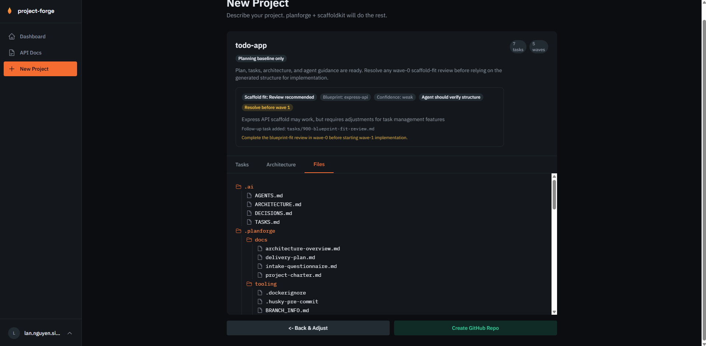

# project-forge ⚒️

A web platform for creating AI-toolchain projects. Describe your project — [agent-planforge](https://github.com/LanNguyenSi/agent-planforge) and [scaffoldkit](https://github.com/LanNguyenSi/scaffoldkit) do the rest.

**Live:** [project-forge.opentriologue.ai](https://project-forge.opentriologue.ai)

`project-forge` resolves generated planforge artifacts via `planforge-index.json` when available and falls back to legacy root paths for older planforge installations.



## What It Does

1. **Describe** — Fill in a form (or use the ✨ AI magic fill)
2. **Review** — Browse generated tasks, architecture overview, and file tree
3. **Confirm** — Create a GitHub repo with the scaffold pushed
4. **Build** — Clone and hand off to your agent

AI is optional. Without it, `project-forge` uses deterministic intake mapping plus `agent-planforge` heuristics. If a local or hosted AI provider is configured, `project-forge` also uses it server-side to enrich intake and review scaffold fit after `scaffoldkit` runs.

Also available as a REST API for agents — see the [API section](#api) below.

## Prerequisites

project-forge talks to a single dependency: the **agent-planforge HTTP service**, which runs both the planforge CLI and scaffoldkit in its own container and returns the scaffolded project as a tarball over HTTP (per [ADR-0002](docs/adrs/0002-tool-decoupling-service-boundary.md)). Docker Compose wires it in automatically; nothing to install on the host.

## Quick Start (Docker)

```bash
git clone https://github.com/LanNguyenSi/project-forge.git
cd project-forge
cp .env.example .env
# Fill in required values (see below)
make deploy
```

### Required Environment Variables

| Variable | Description |
|---|---|
| `NEXTAUTH_SECRET` | Random secret (`openssl rand -hex 32`) |
| `NEXTAUTH_URL` | Public URL (e.g. `https://project-forge.example.com`) |
| `DATABASE_URL` | SQLite path (e.g. `file:/data/project-forge.db`) |
| `PLANFORGE_URL` | URL of the planforge HTTP service (defaults to `http://planforge:8223` in compose). |
| `PLANFORGE_SERVICE_TOKEN` | Shared bearer token for the planforge HTTP service. Generate with `openssl rand -hex 32`. Same value in both `app` and `planforge` containers. |

> Publishing a repo uses each **user's own** GitHub Personal Access Token (PAT),
> added in the dashboard, not a platform-wide token. There is no server-level
> `GITHUB_TOKEN` or `GITHUB_OWNER` env var. For OAuth sign-in, set the optional
> `GITHUB_ID` / `GITHUB_SECRET` below.

### Optional

| Variable | Description |
|---|---|
| `OPENAI_API_KEY` | Enables AI magic fill (OpenAI GPT-4o-mini) |
| `GROQ_API_KEY` | Enables AI magic fill (Groq, preferred — free) |
| `LOCAL_AI_BASE_URL` | Enables a local OpenAI-compatible model endpoint for AI magic fill and server-side intake enrichment |
| `LOCAL_AI_MODEL` | Model name for the local AI endpoint |
| `LOCAL_AI_API_KEY` | Optional API key for the local AI endpoint |
| `GITHUB_ID` | GitHub OAuth app Client ID |
| `GITHUB_SECRET` | GitHub OAuth app Client Secret |
| `ALLOWED_GITHUB_LOGINS` | Comma-separated allowlist of GitHub logins permitted to register via the project-pilot broker. Unset/empty = accept any. |
| `FORGE_TEMP_DIR` | Directory for temporary build artifacts (defaults to `/tmp/project-forge`) |

### Docker Compose

The root `docker-compose.yml` ships two services:

- `app` — the project-forge Next.js runtime.
- `planforge`: the agent-planforge HTTP service (per [ADR-0002](docs/adrs/0002-tool-decoupling-service-boundary.md)). Built from the sibling `agent-planforge` checkout via `context: ../agent-planforge` (see `docker-compose.yml`). Runs both the planforge CLI and scaffoldkit in-container. **Internal-only**, no Traefik labels, no published ports. `app` reaches it via the shared `traefik` docker network at `http://planforge:8223`.

Both services need `PLANFORGE_SERVICE_TOKEN` in `.env`. Compose propagates it; mismatched values cause `app` to get 401s from `planforge`.

**Token rotation (manual, v1):**

```bash
cd /root/git/project-forge
NEW_TOKEN=$(openssl rand -hex 32)
sed -i "s/^PLANFORGE_SERVICE_TOKEN=.*/PLANFORGE_SERVICE_TOKEN=$NEW_TOKEN/" .env
docker compose up -d --build  # rebuild both so the new token is live simultaneously
```

A token store + in-place rotation is a follow-up (see ADR-0002).

## API

All endpoints require an API token generated in the dashboard, passed via the `X-API-Key` header.

Rate limit: 10 project publishes per user per day. Only `publish` and the one-shot `POST /api/v1/projects` count against it; `generate`, `preview`, and the project list/delete endpoints are unmetered. The quota is counted per user, across all of that user's tokens.

### `GET /api/v1/projects`

List all projects for the authenticated user.

```bash
curl https://project-forge.opentriologue.ai/api/v1/projects \
  -H "X-API-Key: pf_your_token_here"
```

### `DELETE /api/v1/projects`

Soft-delete a project by its `id` (the `id` field returned by `GET /api/v1/projects`), passed as a query parameter.

```bash
curl -X DELETE "https://project-forge.opentriologue.ai/api/v1/projects?id=clx..." \
  -H "X-API-Key: pf_your_token_here"
```

### `POST /api/v1/generate`

Generate a project scaffold without publishing it. Returns a `sessionId` (a UUID) used by `preview` and `publish`. A session expires one hour after it is generated.

```bash
curl -X POST https://project-forge.opentriologue.ai/api/v1/generate \
  -H "X-API-Key: pf_your_token_here" \
  -H "Content-Type: application/json" \
  -d '{
    "projectName": "my-cli-tool",
    "summary": "A CLI that syncs agent memory via Git",
    "features": ["push memory files", "pull and merge", "conflict resolution"],
    "constraints": ["TypeScript only", "no external databases"],
    "targetUsers": ["developers", "AI agents"]
  }'
```

**Response:**
```json
{
  "ok": true,
  "sessionId": "f47ac10b-58cc-4372-a567-0e02b2c3d479",
  "preview": { "...": "file tree, tasks, architecture overview" }
}
```

### `GET /api/v1/preview`

Fetch the generated preview (file tree, tasks, architecture) for a given `sessionId` (the value returned by `generate`).

```bash
curl "https://project-forge.opentriologue.ai/api/v1/preview?sessionId=f47ac10b-58cc-4372-a567-0e02b2c3d479" \
  -H "X-API-Key: pf_your_token_here"
```

### `POST /api/v1/publish`

Finalize a previewed project and create the GitHub repository. Requires a GitHub PAT configured in your dashboard, and counts against your daily publish quota.

```bash
curl -X POST https://project-forge.opentriologue.ai/api/v1/publish \
  -H "X-API-Key: pf_your_token_here" \
  -H "Content-Type: application/json" \
  -d '{ "sessionId": "f47ac10b-58cc-4372-a567-0e02b2c3d479" }'
```

**Response:**
```json
{
  "ok": true,
  "result": {
    "repoUrl": "https://github.com/your-username/my-cli-tool",
    "cloneUrl": "https://github.com/your-username/my-cli-tool.git",
    "projectName": "my-cli-tool"
  }
}
```

### `POST /api/v1/projects`

One-shot create: generate, scaffold, create the GitHub repository, and push in a single call, skipping the separate preview step. Requires a GitHub PAT configured in your dashboard, and counts against your daily publish quota. The request body is the same shape as `generate`.

```bash
curl -X POST https://project-forge.opentriologue.ai/api/v1/projects \
  -H "X-API-Key: pf_your_token_here" \
  -H "Content-Type: application/json" \
  -d '{
    "projectName": "my-cli-tool",
    "summary": "A CLI that syncs agent memory via Git",
    "features": ["push memory files", "pull and merge"]
  }'
```

Returns the same `{ ok, result: { repoUrl, cloneUrl, projectName } }` shape as `publish`.

Full API documentation: [project-forge.opentriologue.ai/docs](https://project-forge.opentriologue.ai/docs)

## Tech Stack

- **Frontend:** Next.js 15 + TypeScript + Tailwind CSS
- **Auth:** next-auth (email/password + GitHub OAuth)
- **Database:** SQLite via Prisma (API tokens, users)
- **Planning + Scaffolding:** [agent-planforge](https://github.com/LanNguyenSi/agent-planforge) HTTP service (bundles [scaffoldkit](https://github.com/LanNguyenSi/scaffoldkit) in its own container; project-forge is Node-only)
- **AI:** Local OpenAI-compatible endpoint, Groq (llama-3.3-70b-versatile), or OpenAI (gpt-4o-mini)
- **Deploy:** Docker + Traefik

## Development

```bash
npm install
npm run dev
```

## License

MIT
