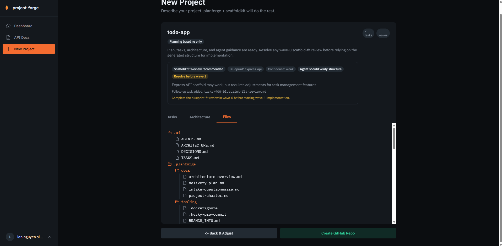

# project-forge

A web platform for creating AI-toolchain projects. Describe your project and
[agent-planforge](https://github.com/LanNguyenSi/agent-planforge) plus
[scaffoldkit](https://github.com/LanNguyenSi/scaffoldkit) do the rest.

[](https://github.com/LanNguyenSi/project-forge/actions/workflows/ci.yml)
[](LICENSE)

**Live:** [project-forge.opentriologue.ai](https://project-forge.opentriologue.ai)



## Overview

You describe a project in a form, project-forge asks the agent-planforge HTTP
service to plan and scaffold it, you review the generated tasks and file
tree, and on confirmation it creates a GitHub repository with the scaffold
pushed. AI is optional: without it, project-forge uses deterministic intake
mapping plus agent-planforge heuristics; with a local or hosted AI provider
configured, it also enriches intake and reviews scaffold fit server-side.
The same flow is exposed as a token-authenticated REST API so agents can
drive generation programmatically.

## Key Features

- Form-based project intake, with optional AI magic fill
- Deterministic fallback when no AI provider is configured
- Review generated tasks, architecture overview, and file tree before anything is created
- One-click GitHub repository creation with the scaffold pushed
- Token-authenticated REST API (`X-API-Key`) for agents: generate, preview, publish, or one-shot create
- Single external dependency: the agent-planforge HTTP service, which bundles scaffoldkit in its own container (see [ADR-0002](docs/adrs/0002-tool-decoupling-service-boundary.md))

## Quick Start (Docker)

```bash
git clone https://github.com/LanNguyenSi/project-forge.git
cd project-forge
cp .env.example .env
# Fill in required values, see docs/configuration.md
cp docker-compose.override.example.yml docker-compose.override.yml
# Fill in NEXTAUTH_SECRET (openssl rand -hex 32) and NEXTAUTH_URL, or delete
# them from the override (its values take precedence over .env). The override
# also points DATABASE_URL at the forge_db volume (mounted at /data by
# docker-compose.yml): DATABASE_URL=file:/data/project-forge.db
make deploy
```

Prerequisites: Docker with Compose, an
[agent-planforge](https://github.com/LanNguyenSi/agent-planforge) checkout next
to this repository (`../agent-planforge`, built as the planforge service by
`docker-compose.yml`), and an existing external Docker network named `traefik`
(`docker network create traefik`; a Traefik instance is needed for public
exposure). Without the override file the SQLite database stays at the
`.env.example` path (`file:./db/project-forge.db`) inside the container instead
of on the persistent `/data` volume. See [docs/deployment.md](docs/deployment.md).

## Usage

```bash
curl -X POST https://project-forge.opentriologue.ai/api/v1/generate \
  -H "X-API-Key: pf_your_token_here" \
  -H "Content-Type: application/json" \
  -d '{
    "projectName": "my-cli-tool",
    "summary": "A CLI that syncs agent memory via Git",
    "features": ["push memory files", "pull and merge"]
  }'
```

Returns `{ ok: true, sessionId, preview }`; pass `sessionId` to `preview` or
`publish`. See [docs/api.md](docs/api.md) for the full REST API reference,
including the one-shot create endpoint and the daily rate limit.

## Documentation

- [Configuration](docs/configuration.md) - required and optional environment variables
- [API reference](docs/api.md) - all v1 REST endpoints, with examples
- [Deployment](docs/deployment.md) - Docker Compose services, service-token rotation
- [Architecture](docs/architecture.md) - system structure, key subsystems, CI/CD pipeline
- [ADR-0002](docs/adrs/0002-tool-decoupling-service-boundary.md) - why planforge is the single HTTP boundary (scaffoldkit stays behind it)
- [Ways of working](docs/ways-of-working.md) - contributor conventions, API conventions, versioning

## Development and Contributing

```bash
npm install
npm run dev
```

Run `npm run typecheck`, `npm run lint`, `npm run build`, and `npm test`
before opening a PR. See [CONTRIBUTING.md](CONTRIBUTING.md) and
[docs/ways-of-working.md](docs/ways-of-working.md) for full conventions.

## License

MIT
